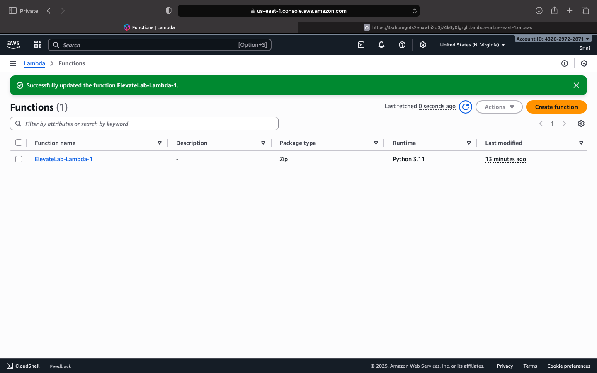
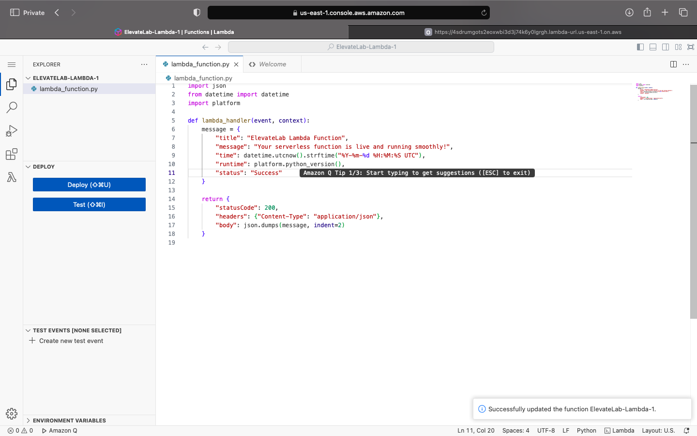
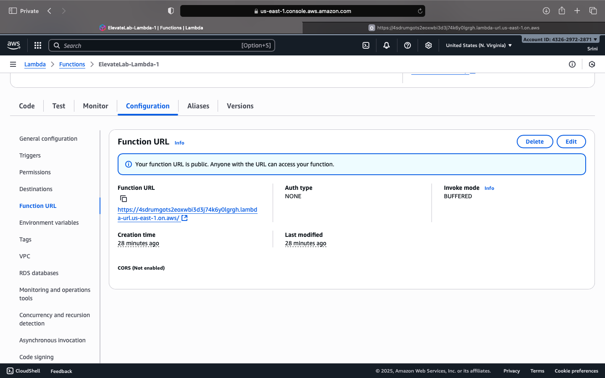
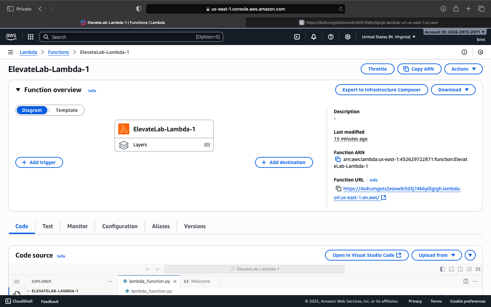

# ElevateLab AWS Lambda Task 4  – Deploy a Serverless Function to AWS Lambda

## Objective
This repository contains a **serverless AWS Lambda function** deployed as part of ElevateLab Task 4.  
The function demonstrates event-driven architecture, HTTP triggers, and returns structured JSON responses with timestamps — all without managing any servers.

## Tools Used
- AWS Lambda (Free Tier)  
- AWS Management Console  
- Optional: VS Code / Postman  

## Deliverables
- Lambda source code (`main.py` or `index.js`)  
- Screenshot of Lambda function deployed  
- Screenshot of successful function test  
- Function URL (HTTP trigger)  
- Short description of the function behavior  

---

### Step 1: Create Lambda Function
1. Click **Create function** → **Author from scratch**  
2. Enter:
   - Function Name: `ElevateLab-Lambda-1`  
   - Runtime: `Python 3.11` (or Node.js 18.x)  
   - Execution Role: **Create a new role with basic Lambda permissions**  
3. Click **Create function**  

**Screenshot:**  


---

### Step 2: Add Function Code
**Python example:**

```python
import json
from datetime import datetime
import platform

def lambda_handler(event, context):
    message = {
        "title": "ElevateLab Lambda Function",
        "message": "Your serverless function is live and running smoothly!",
        "time": datetime.utcnow().strftime("%Y-%m-%d %H:%M:%S UTC"),
        "runtime": platform.python_version(),
        "status": "Success"
    }

    return {
        "statusCode": 200,
        "headers": {"Content-Type": "application/json"},
        "body": json.dumps(message, indent=2)
    }
```

**Screenshot:**  


---

### Step 3: Create a Function URL (HTTP Trigger)

1. In the left panel, go to **Configuration → Function URL.**
2. Click **Create function URL.**
3. Auth type: **NONE** (for testing).
4. Click **Save** → copy the generated URL.

**Screenshot:**  




---

### Step 4: Test Your Function
1. Browser
2. Paste the Function URL into a browser.
   
You’ll see:
```
{
  "title": "ElevateLab Lambda Function",
  "message": "Your serverless function is live and running smoothly!",
  "time": "2025-10-24 13:55:12 UTC",
  "runtime": "3.11.0",
  "status": "Success"
}
```

**Screenshot:**  


---

### Step 5: Check Logs

1. Go to Monitor → View logs in CloudWatch.
2. Verify that each invocation was logged successfully.

---

### Step 6: (Optional) Try a Dynamic Version

```
def lambda_handler(event, context):
    name = event.get("name", "Guest")
    return {
        "statusCode": 200,
        "body": f"Hello, {name}! Welcome to ElevateLab Lambda."
    }
```

---

### Learning Outcomes

1. By completing this task, you will:
2. Understand the concept of serverless computing and FaaS.
3. Learn to create and deploy code without managing servers.
4. Test functions via HTTP triggers.
5. Understand how AWS Lambda scales automatically on demand.


